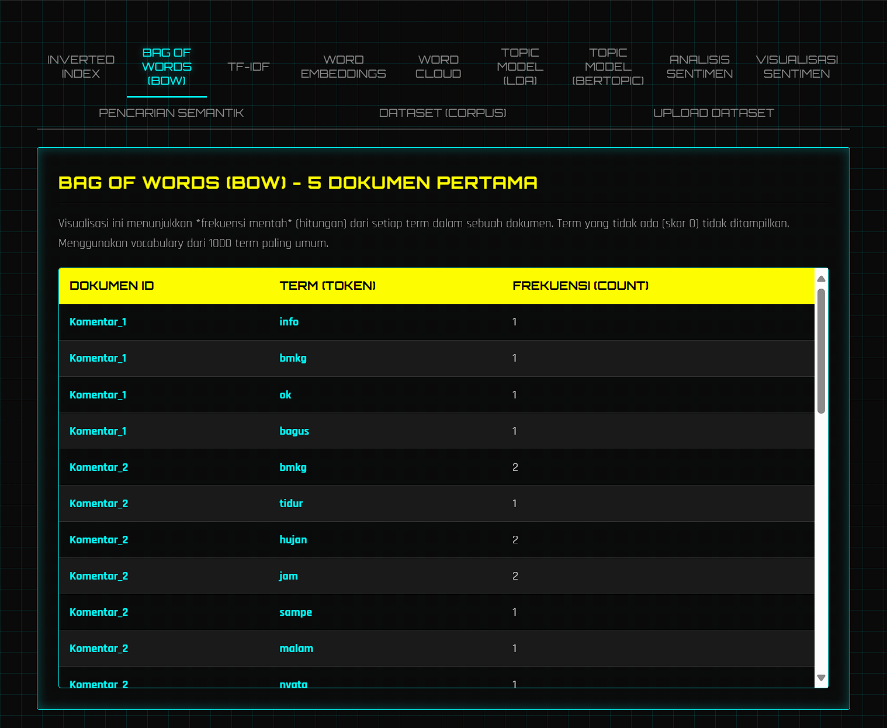
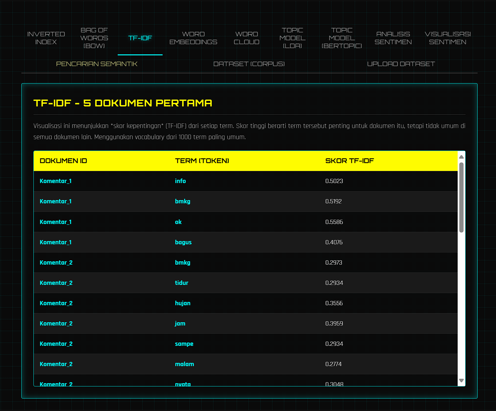
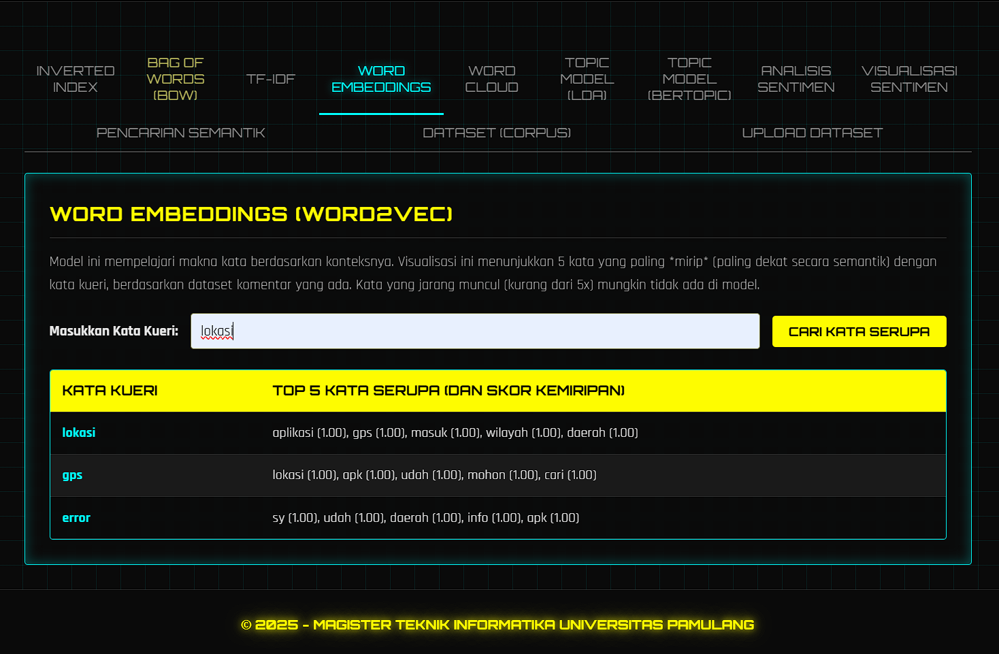
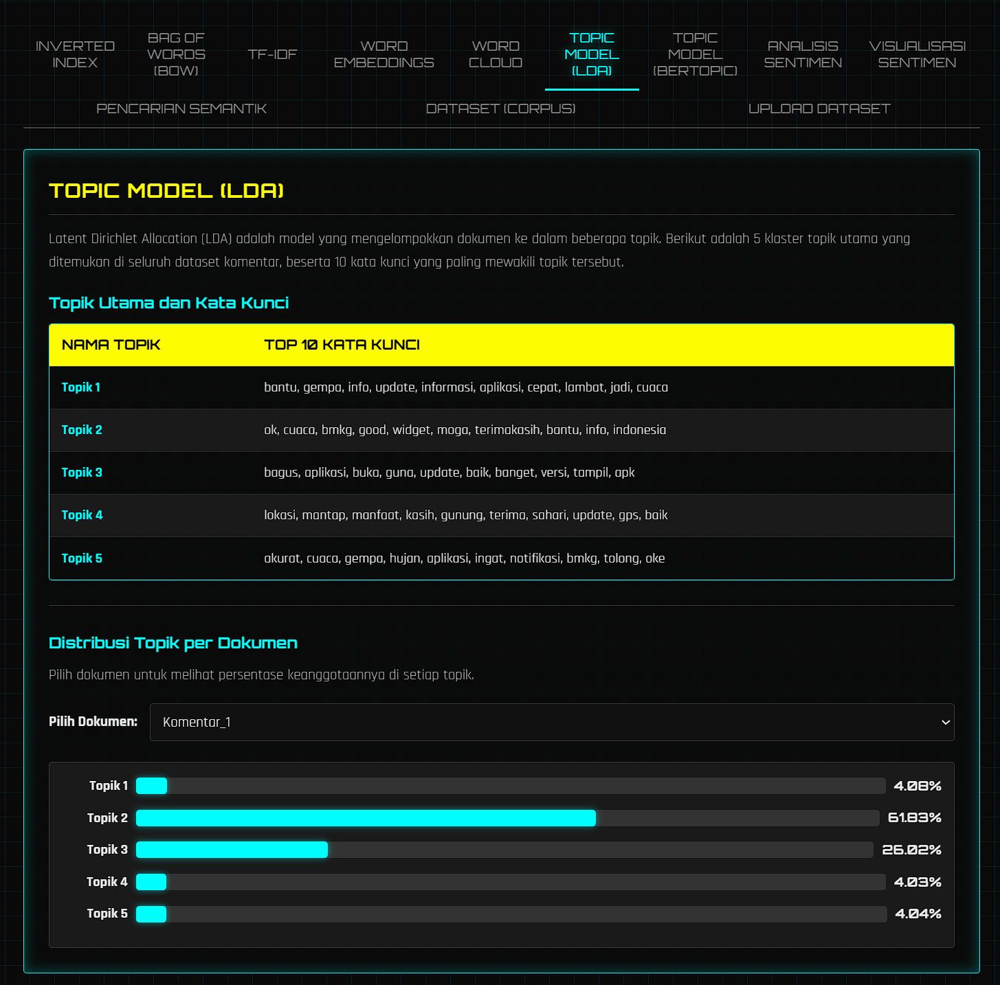
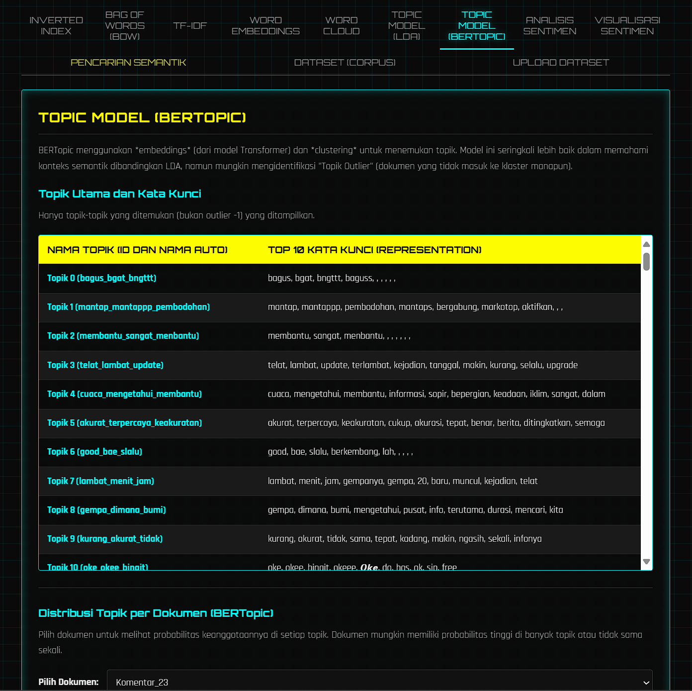
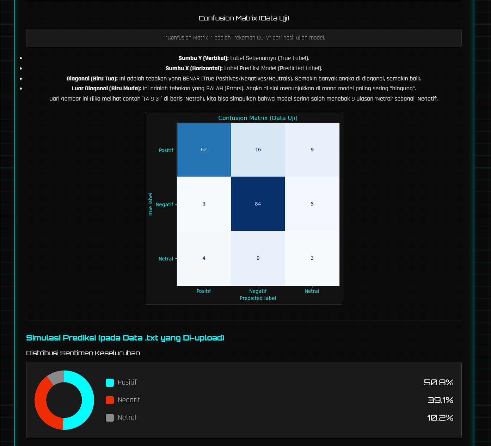
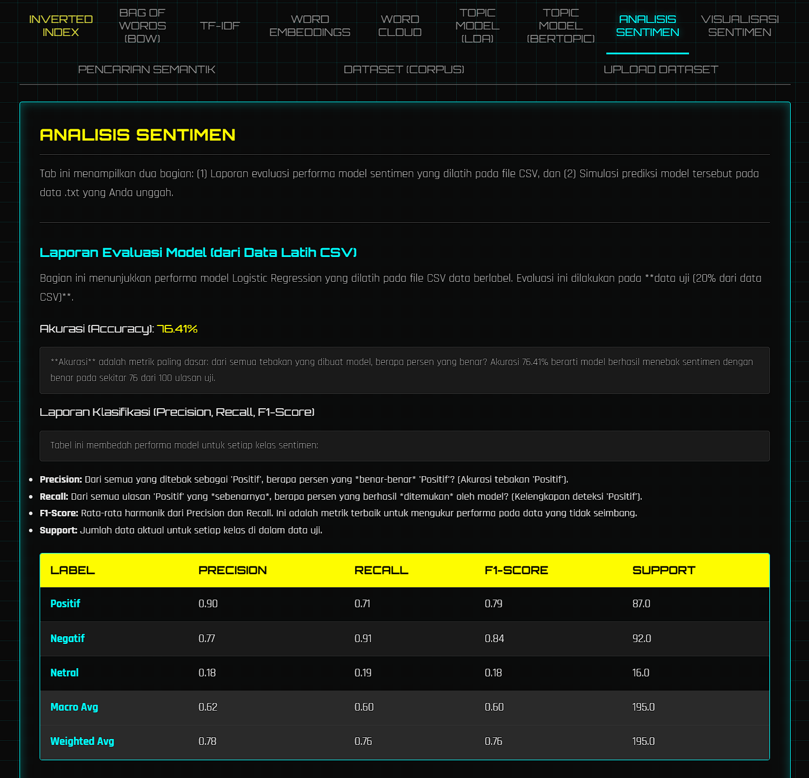
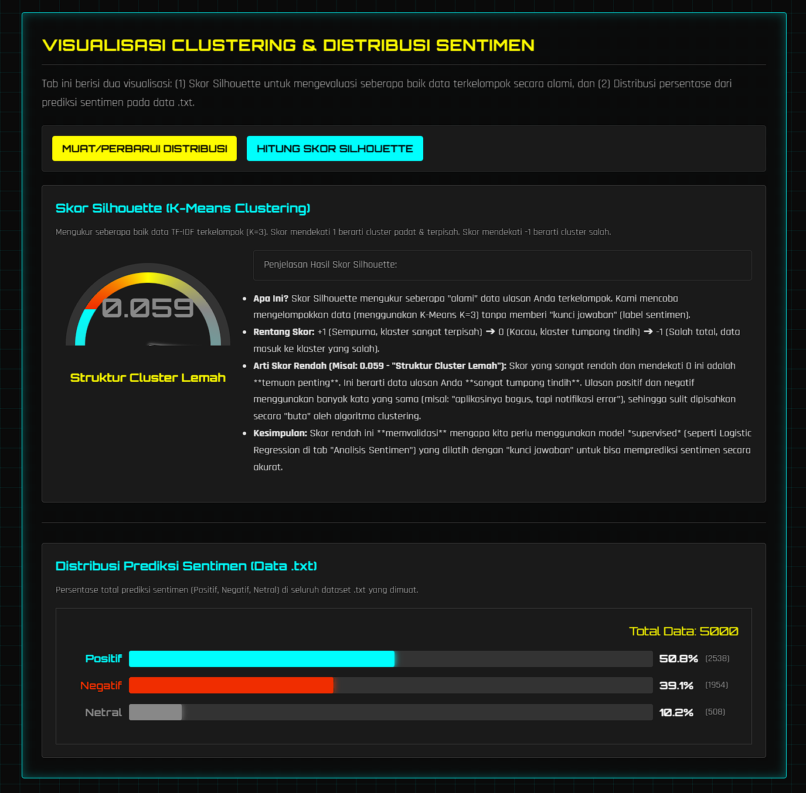
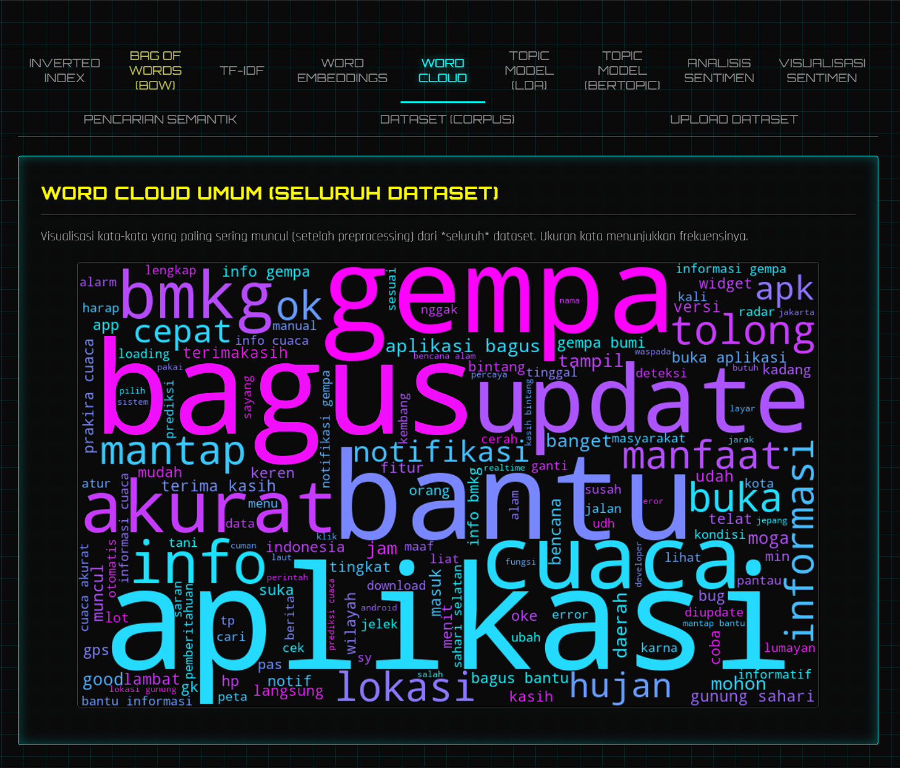
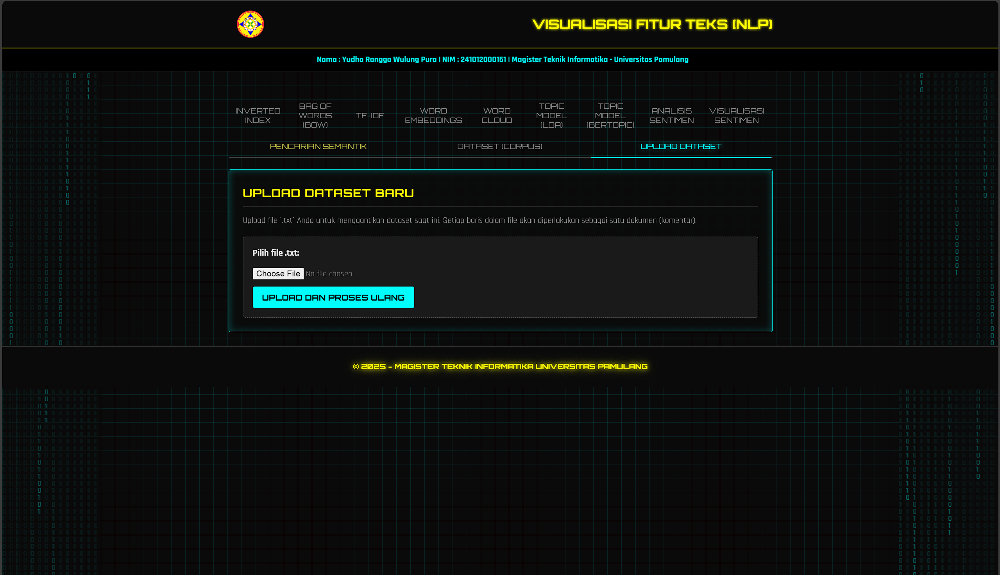

# 🌊 Dashboard Analisis Sentimen & Visualisasi NLP Ulasan Aplikasi BMKG

Dashboard analitik interaktif yang dibangun menggunakan **Flask** untuk membedah dan memvisualisasikan ulasan pengguna aplikasi Info BMKG. Proyek ini mengubah data teks mentah menjadi wawasan strategis melalui berbagai teknik NLP, machine learning, dan visualisasi data.

---

### 👤 Profil Proyek

| Keterangan | Detail |
| :--- | :--- |
| **Mata Kuliah** | Advanced NLP |
| **Dosen Pengampu** | Dr. Sajarwo Anggai, S.ST., M.T |
| **Mahasiswa** | Yudha Rangga Wulung Pura |
| **NIM** | 241012000151 |
| **Institusi** | Magister Teknik Informatika, Universitas Pamulang |

---

## ✨ Fitur Utama & Galeri Proyek

Aplikasi web ini menyajikan analisis data ulasan dalam antarmuka multi-tab yang modern.

### 1. Ekstraksi Fitur Dasar (BoW, TF-IDF, Word Embeddings)

Tab ini menampilkan "tulang punggung" dari analisis NLP, mengubah data teks menjadi representasi numerik yang dapat dipahami mesin.

| Bag of Words (BoW) | TF-IDF | Word Embeddings (Word2Vec) |
| :---: | :---: | :---: |
|  |  |  |

### 2. Topic Modeling Otomatis (LDA & BERTopic)

Untuk memahami tema-tema utama yang dibicarakan pengguna.

| LDA (Latent Dirichlet Allocation) | BERTopic (Modern Contextual Model) |
| :---: | :---: |
|  |  |

### 3. Evaluasi Model & Analisis Sentimen (Supervised)

Ini adalah inti dari dashboard yang menunjukkan performa model Logistic Regression yang telah dilatih dan memprediksi sentimen pada data baru.

| Confusion Matrix (Evaluasi Kinerja) | Distribusi Sentimen (Simulasi Prediksi) |
| :---: | :---: |
|  |  |

### 4. Visualisasi Klastering & Distribusi (Unsupervised)

Analisis data yang diunggah, menampilkan seberapa baik data terkelompok secara alami dan hasil distribusi sentimen.

<p align="center">

</p>

### 5. Visualisasi Word Cloud & Halaman Upload

| Word Cloud (Fokus Kata Kunci) | Halaman Upload Data |
| :---: | :---: |
|  |  |


---

## 🛠️ Alur Kerja (Workflow) Proyek

Aplikasi ini menggunakan dual-pipeline untuk pemrosesan data:

1.  **Pra-Pemrosesan (NLP Pipeline):** Semua teks melalui urutan proses: **Cleaning** → **Tokenization** → **Stopword Removal** (NLTK + Custom) → **Stemming** (Sastrawi).

2.  **Pipeline Data:**
    * **Data Latih (Offline):** File `dataset_bmkg_reviews.csv` digunakan saat `app.py` dijalankan. File ini hanya digunakan untuk melatih model **Logistic Regression** (metode supervised).
    * **Data Analisis (Online):** File `.txt` diunggah oleh pengguna. Data ini diproses oleh **semua** fitur ekstrak fitur, topic modeling, dan visualisasi.

3.  **Logika Server:**
    * **Pelatihan Model:** Saat `app.py` dimulai, ia akan mencari file `.csv` dan melatih model Logistic Regression. Jika file `.csv` tidak ditemukan, server tetap berjalan, namun fitur sentimen (*supervised*) akan dinonaktifkan.
    * **Simulasi Prediksi:** Model Logistic Regression yang sudah ada di memori digunakan untuk memprediksi sentimen pada data `.txt` yang baru diunggah.

---

## 📁 Struktur Proyek

```text
Proyek_ProposalUTS_NLP_YudhaRWP-SentimenAnalisis/
├── app.py                 # File utama Flask (Backend)
├── requirements.txt       # Daftar library Python yang diperlukan
├── .gitignore             # File untuk mengabaikan folder environment
├── README.md              # File ini
├── dataset_bmkg_reviews.csv # (WAJIB ADA) Dataset Latih
├── screenshots/           # Folder untuk menyimpan tangkapan layar
│   └── (Semua file PNG demo)
├── static/
│   ├── css/
│   │   └── style.css      # File styling
│   └── images/
│       └── UNPAM_logo1.png
└── templates/
    └── index.html         # File utama HTML (Frontend)